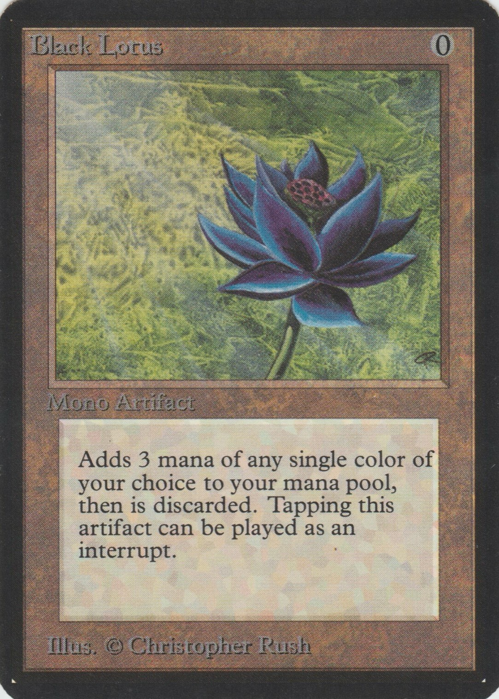

# 🧙‍♂️ Magic The Gathering API — Deck & Card Manager

REST API to manage Magic: The Gathering cards, decks, legalities, and users. Includes JWT authentication, deck-format validations, Cloudinary image uploads, and Swagger documentation

---

## Purpose and Scope 
The MTG application is a web-based system designed to help Magic: The Gathering players manage their card collections and build tournament-legal decks. The system provides:

- Card Collection Management: Users can catalog their Magic cards with full metadata including mana costs, types, colors, and legality formats
- Deck Building: Create and manage decks with format validation and rule enforcement
- Image Storage: Integration with Cloudinary for card image management
- User Authentication: JWT-based security with role-based access control
- Public Deck Sharing: Users can make their decks publicly discoverable
- The application follows a traditional three-tier architecture with a REST API layer, business logic services, and JPA-based data persistence.

---

## 📑 Table of Contents
- [📸 Project Screenshots](#-project-screenshots)
- [✨ Features](#-features)
- [🏗️ Architecture](#-architecture)
- [🧰 Technologies Used](#-technologies-used)
- [📈 Diagrams](#-diagrams)
- [🚀 How to Run](#-how-to-run)
- [🕹️ Usage](#-usage)
- [🧪 Tests](#-tests)
- [🖥️ Security 🔐](#security-)
- [🗂️ Project Structure](#-project-structure)
- [🛡️ Error Handling](#-error-handling)
- [🔭 Future Enhancements](#-future-enhancements)
- [🙏 Acknowledgments](#-acknowledgments)
- [🆘 Support](#-support)
- [👥 Team](#-team)

---

## 📸 Project Screenshots
- Swagger UI: `http://localhost:8080/swagger-ui/index.html`
- Sample image included in repo: `src/main/resources/static/images/black_lotus.jpg`

Example for documentation inclusion:

```markdown

```

---

## ✨ Features
- **Card management**: Full CRUD with types, colors, and legalities.
- **Deck management**: Format rules, commander, max copies, and search.
- **JWT auth and authorization**: Validation filters, roles, and permissions.
- **Image uploads**: Cloudinary integration.
- **Robust validations**: DTO, service, and business rule levels.
- **OpenAPI/Swagger docs**: Discoverable, browsable endpoints.
- **Dockerized**: Consistent execution and packaging.
- **Unit and integration tests**: JUnit 5 and Mockito.

---

## 🏗️ Architecture
Layered architecture with strong separation of concerns and DTO isolation.

Folder diagram (simplified):

```text
src/main/java/com/MagicTheGathering
├─ auth/                     # JWT, security filters and helpers
├─ card/                     # Card domain + DTOs/exceptions
├─ cardType/                 # Card type enums/entities
├─ Cloudinary/               # Image upload integration
├─ config/                   # Global config: security, swagger, cloudinary
├─ deck/                     # Deck domain + search controllers
├─ deckCard/                 # Card-deck relationship
├─ deckCartId/               # Composite ID for deck-card
├─ email/                    # Send emails service
├─ Exceptions/               # Global handler and common exceptions
├─ legality/                 # Legalities entities/enums
├─ manaColor/                # Mana color enums
├─ role/                     # Roles + custom validations
└─ user/                     # Users + DTOs + security utilities
```

Key points:
- Controllers delegate to services; services implement business rules.
- DTOs (`Request`/`Response`) isolate transport from the domain.
- Deck format validations encapsulated in `FormatValidationService`.
- Security implemented via JWT filters and Spring Security config.

---

## 📈 Diagrams

### Entity-relationship diagram


### Flowchart


## Technologies Used
- **Java 17+**
- **Spring Boot** (Web, Security, Data JPA, Validation)
- **JWT** (authentication/validation filters)
- **Cloudinary** (image uploads)
- **Swagger/OpenAPI** (documentation)
- **Maven** (dependency management and build)
- **H2/PostgreSQL** (based on config) with `schema.sql`/`data.sql`
- **JUnit 5 + Mockito** (tests)
- **Docker & Docker Compose**

---

## 🚀 How to Run

- **Requirements**:
  - Java 17+
  - Maven 3.9+
  - Docker (optional, for containerized deployment)

- **Environment variables (.env optional)**
  If you prefer environment variables (e.g., with Docker Compose), create a `.env` at the root:

```env
DB_URL=
SERVER_PORT=

# CLOUDINARY
CLOUDINARY_CLOUD_NAME=
CLOUDINARY_API_KEY=
CLOUDINARY_API_SECRET=

# DOCKER
MYSQL_ROOT_PASSWORD=
MYSQL_DATABASE=
MYSQL_USER=
MYSQL_PASSWORD=

# EMAIL NOTIFICATIONS
EMAIL=
EMAIL_PASSWORD=
```

- **application.properties (example)**

```properties
spring.application.name=MTG

# Database Configuration
spring.datasource.url=${DB_URL}
spring.datasource.username=${DB_USERNAME}
spring.datasource.password=${DB_PASSWORD}
spring.datasource.driver-class-name=com.mysql.cj.jdbc.Driver

# JPA Configuration
spring.jpa.hibernate.ddl-auto=create-drop
spring.jpa.show-sql=true
spring.jpa.properties.hibernate.format_sql=true
spring.jpa.properties.hibernate.dialect=org.hibernate.dialect.MySQLDialect

# Server Configuration
server.port=${SERVER_PORT}

# Logging Configuration
logging.level.org.springframework=INFO
logging.level.com.electronify=DEBUG

spring.mvc.pathmatch.matching-strategy=ant_path_matcher

# Data Initialization
spring.sql.init.mode=always
spring.jpa.defer-datasource-initialization=true
spring.sql.init.data-locations=classpath:data.sql
spring.sql.init.continue-on-error=false

# Email (SMTP) configuration 
spring.mail.host=smtp.gmail.com
spring.mail.port=587
spring.mail.username=${EMAIL}
spring.mail.password=${EMAIL_PASSWORD}
spring.mail.properties.mail.smtp.auth=true
spring.mail.properties.mail.smtp.starttls.enable=true
spring.mail.properties.mail.smtp.starttls.required=true
spring.mail.properties.mail.smtp.ssl.trust=smtp.gmail.com
spring.mail.properties.mail.smtp.connectiontimeout=5000
spring.mail.properties.mail.smtp.timeout=5000
spring.mail.properties.mail.smtp.writetimeout=5000
spring.mail.properties.mail.debug=false
spring.mail.from=${EMAIL}
spring.mail.test-connection=false
```

- **Install and run (Maven)**

```bash

mvn clean install
mvn spring-boot:run
```

- **Run with Docker**

```bash

docker compose up -d
```

Main endpoints:
- Swagger: [http://localhost:8080/swagger-ui/index.html](http://localhost:8080/swagger-ui/index.html)

---

## 🕹️ Usage

Typical steps (numbered):
1. Authenticate and obtain your JWT.
2. Create the cards you need for your deck.
3. Create the deck specifying format and rules.
4. Add cards to the deck respecting format limits.
5. Query/filter decks using the advanced search.

---

## 🧪 Tests
- Coverage: services, validations, DTO mappers, and controllers.
- Location: `src/test/java/com/MagicTheGathering/...`

Run tests:

```bash

mvn test
```

Run a specific test:

```bash

mvn -Dtest=DeckServiceTest test
```

Examples covered by tests:
- Format rules in `FormatValidationService` (max copies, commander, etc.).
- Authorizations and access to private decks.
- Custom exceptions and global handler behavior.
- Role serialization and DTO validations.

---

## Security 🔐

### Authorization Model
The system implements a two-tier role-based authorization model using the Role enum:

```
Role	|                   Capabilities	            |                Endpoint Access
-----------------------------------------------------------------------------------------------------------------
USER	|  Card and deck management	                    |     /api/cards/**, /api/decks/**, /api/deck-cards
ADMIN	|  User administration and all USER capabilities    |     /api/users/**, /register/admin
```

### Password Encoding
Uses BCryptPasswordEncoder for secure password hashing:

```java
@Bean
PasswordEncoder passwordEncoder() {
  return new BCryptPasswordEncoder();
}
```

### Authentication Manager

Configured through Spring's AuthenticationConfiguration:

```java
@Bean
AuthenticationManager authenticationManager() throws Exception {
  return authenticationConfiguration.getAuthenticationManager();
}
```

### HTTP Security Configuration
The security filter chain defines endpoint protection patterns and session management:

- **Public Endpoints:** ``/swagger-ui/**``, ``/v3/api-docs/**``, ``/register``, ``/login``
- **USER Protected:** All ``/api/cards/**``, ``/api/decks/**``, ``/api/deck-cards/**``
- **ADMIN Protected:** ``/api/users/**``, ``/register/admin`` endpoints
- **Session Management:** Stateless (SessionCreationPolicy.STATELESS)
- **CSRF:* Disabled for API-only usage

### JWT Token Management

The ``AuthServiceHelper`` service handles all JWT token operations:

#### Token Generation
```
          Method                      |	      Purpose	              |     Expiration
---------------------------------------------------------------------------------------------
generateAccessToken(username, claims) |	Primary authentication token  |	1 hour (3600000ms)
generateRefreshToken(username)        | Token refresh capability      | 7 days (604800000ms)

```
#### Token Validation
```
          Method                    |	          Purpose	              |               Returns
---------------------------------------------------------------------------------------------------------------------
validateAccessToken(token)	    | Validates access tokens                 | Claims object
validateRefreshToken(refreshToken)  | Validates refresh tokens                | Claims object
getAuthentication(token)	    | Creates Spring Security Authentication  |	UsernamePasswordAuthenticationToken
```

### Security Filter Chain
The application uses two custom JWT filters integrated into Spring Security's filter chain:

#### Filter Responsibilities

```
          Filter        |	             Purpose	               |                       Key Methods
-----------------------------------------------------------------------------------------------------------------------------
JwtAuthenticationFilter	| Handles login requests and token generation  | attemptAuthentication(), successfulAuthentication()
JwtValidationFilter     | Validates tokens on protected requests       | doFilterInternal()

```

---

## 🗂️ Project Structure

```text
MTG/
├─ docker-compose.yml
├─ Dockerfile
├─ pom.xml
├─ src/
│  ├─ main/
│  │  ├─ java/com/MagicTheGathering/
│  │  │  ├─ auth/
│  │  │  ├─ card/
│  │  │  ├─ cardType/
│  │  │  ├─ Cloudinary/
│  │  │  ├─ config/
│  │  │  ├─ deck/
│  │  │  ├─ deckCard/
│  │  │  ├─ deckCartId/
│  │  │  ├─ email/
│  │  │  ├─ Exceptions/
│  │  │  ├─ legality/
│  │  │  ├─ manaColor/
│  │  │  ├─ role/
│  │  │  └─ user/
│  │  └─ resources/
│  │     ├─ application.properties
│  │     ├─ data.sql
│  │     ├─ schema.sql
│  │     └─ static/images/black_lotus.jpg
│  └─ test/
│     ├─ java/com/MagicTheGathering/
│     └─ resources/
└─ target/
```

---

## 🛡️ Error Handling
Centralized handling with `GlobalExceptionHandler`:

- **Database errors**: integrity violations, not found.
- **Validation**: Bean Validation and business rule errors.
- **Runtime**: unhandled errors return 500 with traces logged.

Highlighted exceptions:
- `CardIdNotFoundException`, `DeckIdNotFoundException`, `CardIdNotFoundInDeckException`
- `MaxCopiesAllowedException`, `MaxCommanderException`, `IllegalCardException`
- `UnauthorizedAccessException`, `UnauthorizedModificationsException`

Generic error response structure:

```json
{
  "timestamp": "2025-01-01T10:00:00Z",
  "status": 403,
  "error": "Forbidden",
  "message": "You are not allowed to modify this deck",
  "path": "/decks/1"
}
```

---

## 🔭 Future Enhancements
- [ ] Pagination and sorting support across listings
- [ ] Continuous delivery (CI/CD) and minimum Jacoco coverage
- [ ] Reinforce advanced Commander/Modern/Pioneer rules
- [ ] Implement new TCG games (Pokémon, Yu-Gi-Oh!...)

---

## 🙏 Acknowledgments
- Spring community and official documentation.
- Original FEMCODERS25 project team.
- Inspiration from the MTG community.

---

## 🆘 Support
Quick troubleshooting guide:
- App does not start: verify Java 17+ and required env variables.
- Image upload error: check Cloudinary credentials and connectivity.
- Unexpected 401/403: verify JWT validity, expiration, and roles.
- DB issues: validate `schema.sql`/`data.sql` and `spring.jpa.hibernate.ddl-auto`.
- Swagger not loading: confirm `SwaggerConfig` and server at `:8080`.

---

## 👥 Team
- [Paula Calvo](https://github.com/PCalvoGarcia)
---

Contributing? Create a descriptive branch, open a PR with a clear description, and add tests whenever possible.
